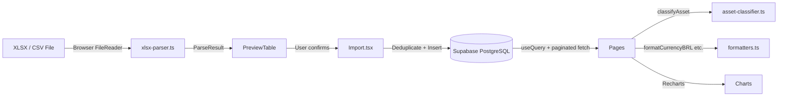

# Portfolio Tracker — Architecture & Business Logic

> **Repository:** `joao-sallaberry/portfolio-tracker`
> **Generated from source on:** 2026-04-26

---

## 1. High-Level Summary

Portfolio Tracker is a **single-page web application** for managing a personal investment portfolio on the Brazilian stock market (**B3**). It allows a user to:

1. **Import** brokerage account statements (XLSX/CSV) containing trade operations and dividend events.
2. **Browse** imported trades and dividends with rich filtering and pagination.
3. **View** an aggregated position (quantity × average price) per asset.
4. **Analyse** income tax obligations by computing capital gains, losses, and accumulated tax per month/year.
5. **Visualise** portfolio distribution and dividend history through interactive charts.

The entire UI is in **Brazilian Portuguese**.

---

## 2. Tech Stack

| Layer | Technology | Notes |
|---|---|---|
| **Build** | [Vite 5](file:///home/joao/Documents/repos/portfolio-tracker/vite.config.ts) + SWC plugin | Dev server on port `8080` |
| **UI Framework** | React 18 (TypeScript) | No SSR — pure SPA |
| **Routing** | `react-router-dom` v6 | Client-side routing |
| **Styling** | TailwindCSS 3 + `tailwindcss-animate` | Theme defined in [index.css](file:///home/joao/Documents/repos/portfolio-tracker/src/index.css) with light/dark mode CSS variables |
| **Component Library** | shadcn/ui (Radix primitives) | 49 UI components in `src/components/ui/` |
| **Charts** | Recharts 2 | Bar charts, pie charts |
| **Server / Data** | [Supabase](file:///home/joao/Documents/repos/portfolio-tracker/src/integrations/supabase/client.ts) (PostgreSQL + Auth) | Hosted instance `vhihtrrnbxsxaqbrivam.supabase.co` |
| **State / Caching** | TanStack React Query v5 | All data fetching is via `useQuery` |
| **File Parsing** | [SheetJS (xlsx)](file:///home/joao/Documents/repos/portfolio-tracker/src/lib/xlsx-parser.ts) | Client-side XLSX/CSV parsing |
| **Form Validation** | Zod + React Hook Form | Installed but **not actively used** in current pages |
| **Date Utilities** | `date-fns` with `ptBR` locale | Localised date formatting |
| **Icons** | `lucide-react` | SVG icon library |
| **Fonts** | DM Sans (body) + JetBrains Mono (monospace) | Loaded from Google Fonts in [index.css](file:///home/joao/Documents/repos/portfolio-tracker/src/index.css#L1) |
| **Dev Tooling** | `lovable-tagger` | Component tagger active in dev mode only |

---

## 3. Project Structure

```
portfolio-tracker/
├── index.html                  # HTML shell (SPA entry)
├── vite.config.ts              # Build config, `@` → `./src` alias
├── tailwind.config.ts          # Tailwind theme extensions
├── .env                        # Supabase URL + anon key
├── supabase/
│   ├── schema_unified.sql      # Full DB schema (DDL + RLS)
│   └── migrations/             # 8 incremental migration files
└── src/
    ├── main.tsx                # React root mount
    ├── App.tsx                 # Auth guard + router + providers
    ├── index.css               # Design system tokens (CSS vars)
    ├── App.css                 # Minor app-level styles
    ├── integrations/supabase/
    │   ├── client.ts           # Supabase client singleton
    │   └── types.ts            # Auto-generated DB types
    ├── lib/
    │   ├── formatters.ts       # BRL currency, dates, number parsing
    │   ├── asset-classifier.ts # Ticker → asset class lookup
    │   ├── xlsx-parser.ts      # XLSX/CSV → typed row arrays
    │   └── utils.ts            # `cn()` helper (clsx + tailwind-merge)
    ├── data/
    │   ├── Acoes.csv           # Known stock tickers
    │   ├── ETFs.csv            # Known ETF tickers
    │   ├── FIIs.csv            # Known FII tickers
    │   ├── FI-Infras.csv       # Known FI-Infra tickers
    │   └── FIPs.csv            # Known FIP tickers
    ├── hooks/
    │   ├── use-mobile.tsx      # Responsive breakpoint hook
    │   └── use-toast.ts        # Toast re-export
    ├── components/
    │   ├── NavLink.tsx         # Active-state NavLink wrapper
    │   ├── layout/
    │   │   ├── AppLayout.tsx   # Sidebar + main content shell
    │   │   └── AppSidebar.tsx  # Navigation sidebar
    │   ├── import/
    │   │   ├── FileUploadCard.tsx  # Drag-and-drop file upload
    │   │   └── PreviewTable.tsx    # Parsed data preview + confirm
    │   └── ui/                 # 49 shadcn/ui components (not modified)
    └── pages/
        ├── Auth.tsx            # Login / Sign-up
        ├── Index.tsx           # Dashboard (Visão Geral)
        ├── Import.tsx          # Data import workflow
        ├── Negociacoes.tsx     # Trade history browser
        ├── Proventos.tsx       # Dividend history browser
        ├── Posicao.tsx         # Current position summary
        ├── ImpostoRenda.tsx    # Income tax calculator
        ├── Configuracoes.tsx   # Settings (profile + logout)
        └── NotFound.tsx        # 404 page
```

---

## 4. Database Schema

Defined in [schema_unified.sql](file:///home/joao/Documents/repos/portfolio-tracker/supabase/schema_unified.sql). Two tables, both multi-tenant via `user_id`:

### 4.1 `trade_operations`

| Column | Type | Constraint |
|---|---|---|
| `id` | UUID (PK) | auto-generated |
| `user_id` | TEXT | **NOT NULL** — maps to `auth.uid()` |
| `trade_date` | DATE | |
| `movement_type` | TEXT | `CHECK (IN ('BUY', 'SELL'))` ¹ |
| `movement_type_raw` | TEXT | original label from the file |
| `market` | TEXT | e.g. `"Bovespa"` |
| `maturity` | TEXT (nullable) | |
| `institution` | TEXT | broker name |
| `ticker` | TEXT | e.g. `"PETR4"` |
| `quantity` | NUMERIC | |
| `price` | NUMERIC | per-unit price |
| `total_value` | NUMERIC | `quantity × price` |
| `created_at` | TIMESTAMPTZ | auto `now()` |

> ¹ **Gap:** The `CHECK` constraint in the DDL only allows `BUY` and `SELL`, but the application code also writes `BONUS`, `SPLIT`, `REVERSE_SPLIT`, and `AMORTIZATION`. Migration `20260201215723_allow_all_movements.sql` likely relaxes this constraint.

**Indexes:** `user_id`, `ticker`, `trade_date`, plus a composite unique index on all business columns (per-user deduplication).

### 4.2 `dividend_events`

| Column | Type | Constraint |
|---|---|---|
| `id` | UUID (PK) | auto-generated |
| `user_id` | TEXT | **NOT NULL** |
| `product_raw` | TEXT | original product name |
| `ticker` | TEXT | extracted by `extractTicker()` |
| `payment_date` | DATE | |
| `event_type` | TEXT | e.g. `"Dividendos"`, `"JCP"`, `"Rendimento"` |
| `institution` | TEXT | |
| `quantity` | NUMERIC | share quantity at payment |
| `unit_price` | NUMERIC | dividend per share |
| `net_value` | NUMERIC | total net amount received |
| `created_at` | TIMESTAMPTZ | auto `now()` |

**Indexes:** Same strategy — lookup by `user_id`, `ticker`, `payment_date`, plus a composite unique index for deduplication.

### 4.3 Row-Level Security

Both tables have RLS enabled with four policies each (SELECT, INSERT, UPDATE, DELETE) enforcing `auth.uid()::text = user_id`. All data access is **scoped per authenticated user**.

---

## 5. Authentication

Implemented in [Auth.tsx](file:///home/joao/Documents/repos/portfolio-tracker/src/pages/Auth.tsx).

- **Email + password** authentication via Supabase Auth (`signInWithPassword` / `signUp`).
- No OAuth or magic-link providers are configured.
- Session is persisted in `localStorage` with auto-refresh tokens ([client.ts](file:///home/joao/Documents/repos/portfolio-tracker/src/integrations/supabase/client.ts#L11-L16)).
- Route protection is implemented in [App.tsx](file:///home/joao/Documents/repos/portfolio-tracker/src/App.tsx#L56-L76): unauthenticated users are redirected to `/auth`; authenticated users on `/auth` are redirected to `/`.

---

## 6. Routing & Layout

### 6.1 Route Map

| Path | Page Component | Description |
|---|---|---|
| `/auth` | `Auth` | Login / Sign-up (public) |
| `/` | `Index` | Dashboard overview |
| `/importar` | `Import` | Data import from files |
| `/negociacoes` | `Negociacoes` | Trade operations browser |
| `/proventos` | `Proventos` | Dividend events browser |
| `/posicao` | `Posicao` | Current position summary |
| `/imposto-renda` | `ImpostoRenda` | Income tax calculator |
| `/configuracoes` | `Configuracoes` | User settings |
| `*` | `NotFound` | 404 fallback |

All routes except `/auth` are wrapped in [AppLayout](file:///home/joao/Documents/repos/portfolio-tracker/src/components/layout/AppLayout.tsx), which provides a collapsible sidebar + header with sidebar trigger.

### 6.2 Sidebar Navigation

Defined in [AppSidebar.tsx](file:///home/joao/Documents/repos/portfolio-tracker/src/components/layout/AppSidebar.tsx#L14-L22). Uses the shadcn/ui `Sidebar` component with active-state highlighting via `useLocation()`.

---

## 7. Data Import Pipeline

The import page ([Import.tsx](file:///home/joao/Documents/repos/portfolio-tracker/src/pages/Import.tsx)) is the **primary data ingestion path**. It handles two independent import flows:

### 7.1 State Machine

Each flow (proventos / negociações) goes through: `idle → parsing → preview → importing → success | error`.

### 7.2 File Parsing

Implemented in [xlsx-parser.ts](file:///home/joao/Documents/repos/portfolio-tracker/src/lib/xlsx-parser.ts).

#### Proventos (Dividend Events)

- **Input:** XLSX file matching the B3/broker statement format.
- **Expected columns:** `Produto`, `Pagamento`, `Tipo de Evento`, `Instituição`, `Quantidade`, `Preço unitário`, `Valor líquido`.
- **Parser:** `parseProventosFile()` — reads via SheetJS, validates headers, parses each row with `parseExcelDate()` and `parseNumberBR()`, extracts tickers via `extractTicker()`.
- **Output:** `ParseResult<DividendEventRow>` with `data[]`, `errors[]`, `warnings[]`, `totalRows`.

#### Negociações (Trade Operations)

Two formats are supported via `parseNegociacaoFileAuto()`:

1. **XLSX** (B3 official statement): Columns `Data do Negócio`, `Tipo de Movimentação`, `Mercado`, `Prazo/Vencimento`, `Instituição`, `Código de Negociação`, `Quantidade`, `Preço`, `Valor`. Parsed by `parseNegociacaoFile()`.

2. **Simplified CSV**: Columns `Ticker`, `Data`, `Preço un.`, `Qtd`, `Tipo`. Parsed by `parseNegociacaoCSV()`. Dates accepted in both `DD/MM/YYYY` and `DD/MM/YY` formats.

#### Movement Type Normalisation

Handled by [normalizeMovementType()](file:///home/joao/Documents/repos/portfolio-tracker/src/lib/formatters.ts#L107-L125):

| Raw input (Portuguese) | Normalised value |
|---|---|
| `Compra`, `buy` | `BUY` |
| `Venda`, `sell` (default) | `SELL` |
| `Bonificação`, `bonus` | `BONUS` |
| `Desdobramento`, `split` | `SPLIT` |
| `Grupamento`, `reverse_split` | `REVERSE_SPLIT` |
| `Amortização`, `amortization` | `AMORTIZATION` |

### 7.3 Preview & Confirmation

After parsing, data is shown in a [PreviewTable](file:///home/joao/Documents/repos/portfolio-tracker/src/components/import/PreviewTable.tsx) (first 20 rows) with error/warning banners. The user must click **"Confirmar importação"** to proceed.

### 7.4 Deduplication Logic

Before inserting, the Import page fetches **all existing records** for the user and builds a frequency map keyed on business columns. Incoming rows are matched against this map — only genuinely new rows are inserted. This allows the user to re-import the same file without creating duplicates.

The database also has **unique composite indexes** as a secondary deduplication guard.

### 7.5 Data Clearing

Two "clear history" buttons delete all rows from `dividend_events` or `trade_operations` for the current user (via `.delete().neq('id', '00000000-...')` — a workaround since Supabase requires a filter on delete).

---

## 8. Asset Classification

Implemented in [asset-classifier.ts](file:///home/joao/Documents/repos/portfolio-tracker/src/lib/asset-classifier.ts).

### 8.1 Asset Classes

```typescript
type AssetClass = 'Ação' | 'ETF' | 'FII' | 'FI-Infra' | 'FIP' | 'Outro';
```

### 8.2 Classification Method

Five CSV files under `src/data/` are imported at build time (via Vite's `?raw` suffix) and parsed into `Set<string>` lookups keyed on the **first 4 characters** of each ticker (the "base code"):

| CSV File | Asset Class | Delimiter | Ticker Column Index |
|---|---|---|---|
| `Acoes.csv` | Ação | `,` | 0 |
| `ETFs.csv` | ETF | `;` | 2 |
| `FIIs.csv` | FII | `;` | 2 |
| `FI-Infras.csv` | FI-Infra | `;` | 2 |
| `FIPs.csv` | FIP | `;` | 2 |

`classifyAsset(ticker)` checks the base code against each set in order: ETF → FII → FI-Infra → FIP → Ação → fallback `"Outro"`.

> ETFs are checked before Ações because some ETF codes could theoretically collide with stock base codes.

---

## 9. Page-by-Page Business Logic

### 9.1 Dashboard — [Index.tsx](file:///home/joao/Documents/repos/portfolio-tracker/src/pages/Index.tsx)

**Empty state:** If no data exists, shows a welcome screen with a CTA to `/importar`.

**KPIs (4 cards):**
- **Total Investido** (Net Invested): `Σ BUY.total_value − Σ SELL.total_value`
- **Total em Proventos**: `Σ dividend.net_value` (all time)
- **Proventos no Ano**: Same, filtered to current year
- **Operações no Ano**: Count of trades in the current year

**Charts (3):**
1. **Proventos por Mês** — Bar chart of monthly dividend totals (last 12 months).
2. **Distribuição do Portfólio** — Pie chart of net invested value grouped by `AssetClass`.
3. **Proventos por Ativo (Top 8)** — Horizontal bar chart of top dividend-paying tickers.

All data is fetched via paginated Supabase queries (1000 rows/page) to bypass the PostgREST default limit.

### 9.2 Negociações — [Negociacoes.tsx](file:///home/joao/Documents/repos/portfolio-tracker/src/pages/Negociacoes.tsx)

**Features:**
- Paginated data table (50 items/page) with smart pagination controls.
- 5 filter dimensions: start date, end date, movement type, ticker, asset class.
- Summary cards: Total Buys, Total Sells, Operation Count.
- Dates are parsed with `parseISODateLocal()` to avoid timezone offset issues.

### 9.3 Proventos — [Proventos.tsx](file:///home/joao/Documents/repos/portfolio-tracker/src/pages/Proventos.tsx)

**Features:**
- Filterable data table: date range, event type, asset class.
- Summary cards: Total Proventos, Proventos this year, Event count, Distinct event types.
- **Stacked bar chart** of monthly dividends broken down by asset class, with toggleable class visibility via checkboxes.

### 9.4 Posição — [Posicao.tsx](file:///home/joao/Documents/repos/portfolio-tracker/src/pages/Posicao.tsx)

**Calculation:** Aggregates all `trade_operations` per ticker:
- `net_quantity = Σ BUY.quantity − Σ SELL.quantity`
- `average_price = Σ BUY.total_value / Σ BUY.quantity`
- `total_value = net_quantity × average_price`

Filters out tickers with `net_quantity ≤ 0` and sorts by total value descending.

**Display:** Grouped by asset class (Ações, FIIs, ETFs, FI-Infra, FIP, Outros), each rendered as a separate card/table showing per-ticker quantity, average price, total value, and portfolio weight percentage.

> **Limitation:** This is a **cost-basis** position, not a market-value position. There is no live price data or mark-to-market valuation.

### 9.5 Imposto de Renda — [ImpostoRenda.tsx](file:///home/joao/Documents/repos/portfolio-tracker/src/pages/ImpostoRenda.tsx)

The most complex page (864 lines). Two tabs:

#### Tab 1: "Vendas por Classe" (Sales by Tax Group)

Implements Brazilian capital gains tax logic:

**Tax groups:**

| Group | Tax Rate | Asset Classes |
|---|---|---|
| Ações e ETFs | 15% | Ação, ETF |
| FIIs | 20% | FII |
| Isentos | 0% | FI-Infra, FIP |

**Calculation per sale:**
1. Iterate all trades for each ticker in the tax group, sorted by date ascending.
2. Maintain a running `totalCost` and `runningQuantity` using weighted average cost method.
3. For each `SELL` in the selected year:
   - `profit_loss = (sale_price − avg_price_before_sale) × quantity`
   - `tax_due = profit_loss > 0 ? profit_loss × rate : 0`
4. Group sales by month and display in tables.
5. Track **accumulated losses** across months with carry-forward (negative P&L reduces future tax liability).

**Movement type handling in average price calculation:**
- `BUY` / `BONUS`: Add to cost and quantity.
- `SELL` / `AMORTIZATION`: Reduce quantity; recalculate cost proportionally.
- `SPLIT`: Increase quantity, keep total cost constant (dilutes average price).
- `REVERSE_SPLIT`: Decrease quantity, keep total cost constant (concentrates average price).

**Initial accumulated loss:** The user can manually enter a prior-year accumulated loss per tax group/year, which is carried into the monthly calculations.

**Summary cards:** Total Sales, Total Profit/Loss, Total Tax Due.

#### Tab 2: "Por Ativo" (Per Asset)

- Select a ticker and a year.
- **Year-end snapshots:** Shows position (quantity, total value, average price) at Dec 31 of the selected year and the previous year — useful for annual tax declarations.
- **Full trade history:** Table showing every operation for the ticker with running quantity and running average price after each trade.

### 9.6 Configurações — [Configuracoes.tsx](file:///home/joao/Documents/repos/portfolio-tracker/src/pages/Configuracoes.tsx)

Minimal settings page:
- Displays the authenticated user's email.
- Logout button (calls `supabase.auth.signOut()`, redirects to `/auth`).

---

## 10. Formatting Utilities

All in [formatters.ts](file:///home/joao/Documents/repos/portfolio-tracker/src/lib/formatters.ts):

| Function | Purpose |
|---|---|
| `formatCurrencyBRL(n)` | `R$ 1.234,56` via `Intl.NumberFormat` |
| `formatDateBR(d)` | `DD/MM/YYYY` |
| `formatNumber(n, decimals)` | Locale-formatted number |
| `formatCompactNumber(n)` | `1.2K`, `3.4M` |
| `parseISODateLocal(s)` | Parses `YYYY-MM-DD` without timezone offset |
| `parseDateBR(s)` | Parses `DD/MM/YYYY` |
| `parseDateBRShort(s)` | Parses `DD/MM/YY` |
| `parseNumberBR(s)` | Parses `1.234,56` → `1234.56` |
| `parseCurrencyBR(s)` | Strips `R$` prefix, then `parseNumberBR()` |
| `extractTicker(s)` | Extracts ticker from `"PETR4 - PETROBRAS S.A."` format |
| `normalizeMovementType(s)` | Maps Portuguese movement labels to enum |

---

## 11. Design System

### 11.1 Theme

Defined entirely through CSS custom properties in [index.css](file:///home/joao/Documents/repos/portfolio-tracker/src/index.css). The theme uses an **Emerald Financial** palette:

- **Primary:** HSL `160 84% 39%` (emerald green) — used for positive values and brand accents.
- **Destructive:** HSL `0 84% 60%` (red) — used for sell operations and errors.
- **Success:** HSL `142 76% 36%` (green) — used for buy indicators.
- **Warning:** HSL `38 92% 50%` (amber).
- **Sidebar:** Dark navy (`215 28% 17%`) with emerald accents.

Full dark mode is defined but **no toggle is implemented in the UI** — it would be activated by a system-level `prefers-color-scheme: dark` preference (via the `next-themes` dependency, though no `ThemeProvider` is currently mounted).

### 11.2 Custom Utility Classes

| Class | Effect |
|---|---|
| `.gradient-primary` | Emerald gradient background |
| `.gradient-card` | Subtle card gradient |
| `.shadow-glow` | Emerald glow box-shadow |
| `.glass` | Backdrop-blur glassmorphism |

---

## 12. Data Flow Architecture



**Key pattern:** All data queries paginate through Supabase's 1000-row limit with a `while(true)` loop using `.range(from, from + pageSize - 1)`. This is done client-side in every page that needs the full dataset.

---

## 13. Notable Patterns & Decisions

1. **No backend logic:** All business logic (average price calculation, tax computation, deduplication) runs **client-side** in React. There are no Supabase Edge Functions, stored procedures, or database views.

2. **Full data fetch:** Every page that needs data fetches **all records** for the user. There is no server-side filtering, aggregation, or pagination beyond the query cache provided by React Query.

3. **Static asset classification:** Ticker classification is determined at build time from bundled CSV files. This means the classifier is only as current as the CSV data in the repository.

4. **No testing infrastructure:** There are no unit tests, integration tests, or end-to-end tests in the repository.

5. **`lovable-tagger`:** The project appears to have been scaffolded by the [Lovable](https://lovable.dev) AI code generator, as evidenced by the `lovable-tagger` dev dependency, the `index.html` TODO comments referencing "Lovable App", and the auto-generated Supabase types file.

6. **Deduplication strategy:** Two layers — application-level frequency map comparison before insert, plus database-level unique composite indexes as a safety net.

---

## 14. Gaps, Limitations & Assumptions

| Area | Observation |
|---|---|
| **Market prices** | No live or historical market price integration. The "Posição" page shows cost-basis value only, not current market value. |
| **Dark mode toggle** | `next-themes` is installed and dark mode CSS vars are defined, but no `ThemeProvider` or toggle UI exists. Dark mode only activates via OS preference. |
| **SEO / Meta tags** | `index.html` still has Lovable placeholder text for `<title>`, `og:title`, and `og:description`. |
| **Form validation** | `zod` and `react-hook-form` are installed but unused — auth forms use raw `useState`. |
| **DB constraint mismatch** | The `movement_type` CHECK constraint in the original DDL only allows `BUY`/`SELL`, but the app writes 6 distinct values. This is presumably fixed by migration `20260201215723_allow_all_movements.sql`. |
| **Proventos pagination** | The Proventos page renders all filtered results without client-side pagination (unlike Negociações which paginates at 50 items). This could cause performance issues with large datasets. |
| **Tax computation** | The R$20K monthly exemption for stocks (swing-trade) is **not implemented**. The page does not account for day-trade vs. swing-trade tax rate differences (15% vs. 20%). |
| **Error handling** | Most Supabase errors are caught and shown via `sonner` toasts, but there is no global error boundary. |
| **No tests** | Zero automated test coverage. |
| **CSV data freshness** | The asset classification CSVs (`Acoes.csv`, `FIIs.csv`, etc.) are static snapshots. New IPOs or fund listings require manual CSV updates. |
